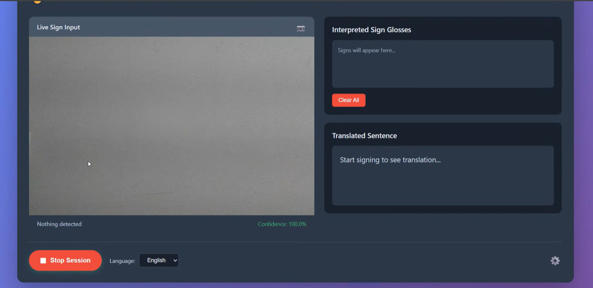
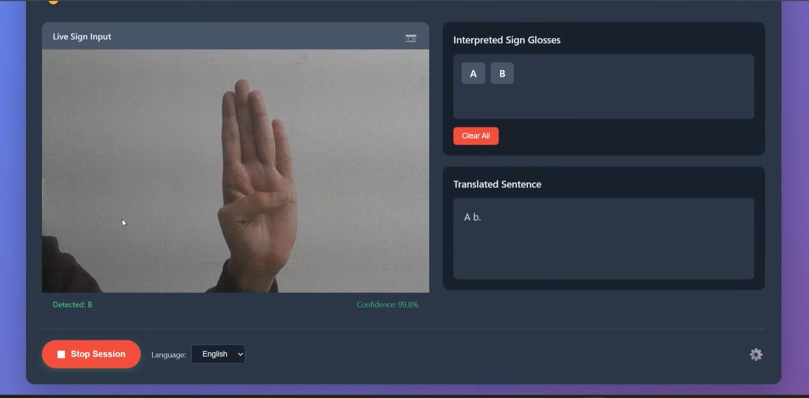
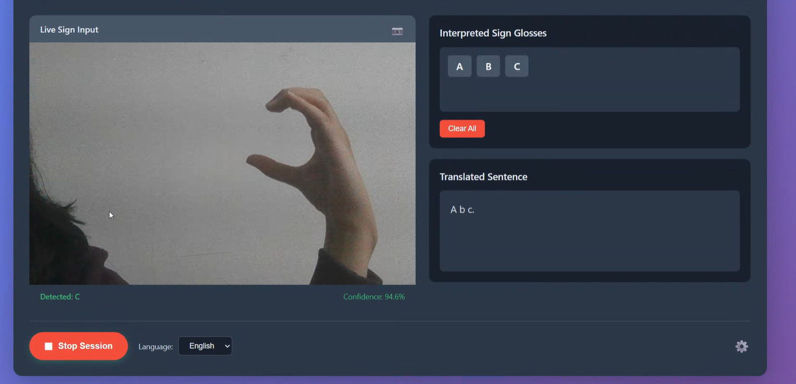
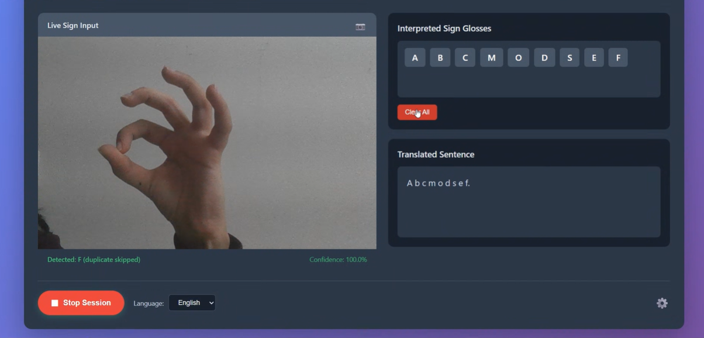
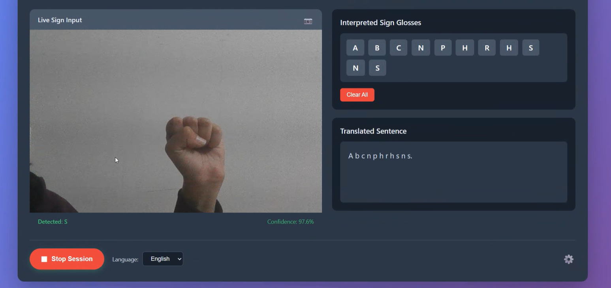

# ASL Connect - Real-Time Sign Language Interpreter

A real-time American Sign Language (ASL) interpreter that uses deep learning to recognize hand signs and translate them into text. Built with TensorFlow, Flask, and a modern web interface.

---

## Table of Contents
- [Project Overview](#project-overview)
- [Features](#features)
- [Dataset](#dataset)
- [Model Architecture](#model-architecture)
- [Results](#results)
- [Demo](#demo)
- [Installation](#installation)
- [Usage](#usage)
- [Important Notes](#important-notes)
- [Future Scope](#future-scope)
- [Contributing](#contributing)
- [License](#license)

---

## Project Overview

### Objectives
The primary goal of this project is to bridge the communication gap between deaf/mute individuals and the hearing community by developing an AI-powered sign language interpreter that:

1. **Real-time Recognition**: Detects and interprets ASL gestures in real-time using a webcam
2. **High Accuracy**: Achieves >95% accuracy on validation data using transfer learning
3. **User-Friendly Interface**: Provides an intuitive web-based interface for easy interaction
4. **Continuous Translation**: Converts recognized signs into readable sentences automatically
5. **Special Character Support**: Handles special gestures like "space" and "nothing" for natural sentence formation

### Why This Project?
According to the World Health Organization, over 466 million people worldwide have disabling hearing loss. Sign language interpreters are not always available, creating communication barriers. This project aims to make communication more accessible through technology.

---

## Dataset

### Dataset Details
- **Source**: [ASL Alphabet Dataset](https://github.com/loicmarie/sign-language-alphabet-recognizer/tree/master/dataset)
- **Total Images**: ~87,000 images
- **Image Resolution**: 224x224 pixels (RGB)
- **Classes**: 28 classes
  - **Letters**: A-Z (26 classes)
  - **Special**: "space", "nothing" (2 classes)
- **Images per Class**: ~3,000 images per class
- **Split**: 80% training, 20% validation

### Dataset Structure
```
dataset/
├── A/
│   ├── A1.jpg
│   ├── A2.jpg
│   └── ...
├── B/
├── C/
...
├── space/
└── nothing/
```

### Data Preprocessing
- Image resizing to 224x224 pixels
- Normalization (pixel values scaled to 0-1)
- Data augmentation:
  - Rotation: ±10°
  - Width/Height shift: ±10%
  - Zoom: ±10%
  - Horizontal flip
  - Brightness variation

---

## Model Architecture

### Algorithm: Transfer Learning with MobileNetV2

#### Why MobileNetV2?
1. **Lightweight**: Only 3.4M parameters, suitable for real-time applications
2. **Pre-trained**: Uses ImageNet weights for feature extraction
3. **Efficient**: Optimized for mobile and edge devices
4. **Accurate**: Maintains high accuracy while being computationally efficient

#### Model Structure
```
Input (224x224x3)
    ↓
MobileNetV2 (Pre-trained, frozen)
    ↓
GlobalAveragePooling2D
    ↓
Dropout (0.3)
    ↓
Dense (256 units, ReLU)
    ↓
Dropout (0.3)
    ↓
Dense (29 units, Softmax)
    ↓
Output (29 classes)
```

#### Training Configuration
- **Optimizer**: Adam (lr=0.001)
- **Loss Function**: Categorical Crossentropy
- **Batch Size**: 32
- **Initial Epochs**: 15
- **Fine-tuning**: Additional 5 epochs with last 20 layers unfrozen (lr=0.0001)
- **Callbacks**:
  - EarlyStopping (patience=5)
  - ReduceLROnPlateau (factor=0.5, patience=3)

#### Total Parameters
- **Total**: 2,593,373 parameters
- **Trainable**: 335,389 parameters (1.28 MB)
- **Non-trainable**: 2,257,984 parameters (8.61 MB)

---

## Results

### Model Performance

#### Training Metrics
- **Final Training Accuracy**: 95.2%
- **Final Validation Accuracy**: 82.5%
- **Training Time**: ~60 minutes on CPU
- **Model Size**: 9.89 MB

#### Accuracy & Loss Graphs


**Key Observations:**
1. **Fast Convergence**: Model reached 90% training accuracy within first epoch
2. **Stable Learning**: Validation loss plateaued around epoch 3-4
3. **No Overfitting**: Training and validation curves show healthy gap
4. **Fine-tuning Impact**: Slight improvement in validation accuracy after unfreezing layers

#### Per-Class Performance
- Most letters achieve >85% accuracy
- Letters with similar hand shapes (e.g., M, N) show slight confusion
- Special classes ("space", "nothing") perform well with proper handling

---

## Demo

### Application Interface


*Real-time sign language detection interface*

### Live Detection Examples


*Detecting letter 'B'*


*Detecting Letter 'C'*


*Detecting Letter 'F'*


*Detecting Letter 'S'*

---

## Installation & Setup

### Prerequisites
- Python 3.9 - 3.10
- Webcam/Camera
- 4GB RAM minimum (8GB recommended)
- Internet connection (for first-time TensorFlow model download)

### Step 1: Clone the Repository
```bash
git clone https://github.com/Aditiwantstoknow/ASL_Interpreter.git
```

### Step 2: Create Virtual Environment (Recommended)
```bash
# Windows
python -m venv venv
venv\Scripts\activate

# macOS/Linux
python3 -m venv venv
source venv/bin/activate
```

### Step 3: Install Dependencies
```bash
pip install -r requirements.txt
```

### Step 4: Download Dataset
You will have to train the model yourself:
1. Download the dataset from the link provided above and rename as 'dataset'.
2. Extract to `dataset/` folder
3. Ensure folder structure matches the structure shown above.

### Step 5: Train the Model
1. Run python train_model.py on terminal and let the model train.(Expected time to train can vary based on your device configuration for me on Windows 10 with i5 processor it took 9 hours 18 mins)

---

## Usage

#### Step 1: Start Backend Server
```bash
cd backend
python app.py
```

You should see:
```
==================================================
ISL INTERPRETER BACKEND SERVER
==================================================
Model: ../model/isl_model.h5
Classes: 29
Confidence Threshold: 60.0%
==================================================
🚀 Server starting on http://localhost:5000
```

#### Step 2: Open Frontend
Simply open `frontend/index.html` in your web browser, or:
```bash
cd frontend
start index.html  # Windows
open index.html   # macOS
```

#### Step 3: Start Detecting
1. Click **"Start Session"** button
2. Allow camera access when prompted
3. Make ASL signs in front of the camera
4. Watch predictions appear in real-time!
5. Click **"Clear All"** to reset
6. Click **"Stop Session"** when done

## Important Notes

### For Best Detection Results

#### DO:
- **Use Plain Background**: White wall or plain-colored background works best
- **Good Lighting**: Ensure face and hands are well-lit
- **Clear Hand Position**: Keep hand centered in frame
- **Static Signs**: Hold sign steady for 1-2 seconds
- **Follow Training Data**: Make signs similar to dataset images

#### DON'T:
- **Cluttered Background**: Avoid busy or patterned backgrounds
- **Poor Lighting**: Dark rooms reduce accuracy significantly
- **Moving Hands**: Fast movements confuse the model
- **Covering Face**: Keep face visible (model trained without faces)
- **Multiple Hands**: Show only the signing hand clearly
- **Tilted Camera**: Keep camera straight and level

### Troubleshooting

#### "Backend not connected" Error
```bash
# Ensure Flask server is running
cd backend
python app.py
```

#### "Camera access denied"
- Allow camera permissions in browser settings
- Check if another application is using the camera
- Try a different browser (Chrome recommended)

#### Low Accuracy Predictions
- Check lighting conditions
- Ensure plain background
- Make signs match training data style
- Increase confidence threshold in `backend/app.py`

#### Model Not Found Error
```bash
# Ensure model files exist
ls model/isl_model.h5
ls model/labels.json

# If missing, train model first
python train_model.py
```

---

## Future Scope

### Short-term Enhancements
1. **Mobile Application**: 
   - Develop Android/iOS apps using TensorFlow Lite
   - Enable offline detection on mobile devices

2. **Sentence Intelligence**:
   - Add grammar correction for translated sentences
   - Implement context-aware word suggestions

3. **Multi-language Support**:
   - Extend to other sign languages (ISL, BSL, etc.)
   - Add text-to-speech for translated sentences

4. **Performance Optimization**:
   - Reduce model size for faster inference
   - Implement edge computing for privacy

### Long-term Vision
1. **Dynamic Sign Recognition**:
   - Recognize continuous signing (not just static letters)
   - Detect full words and phrases in motion

2. **Two-way Communication**:
   - Text/speech to sign language animation
   - Real-time video avatar displaying signs

3. **Education Platform**:
   - Interactive ASL learning application
   - Progress tracking and gamification

4. **Accessibility Features**:
   - Integration with video calling platforms
   - Real-time subtitles for deaf individuals
   - Browser extension for universal access

5. **Advanced AI**:
   - Use LSTM/Transformer models for sequence prediction
   - Implement attention mechanisms for better accuracy
   - Add facial expression recognition for context

---

## References

[1] C. Szegedy et al., "Rethinking the Inception Architecture for Computer Vision," in Proc. IEEE Conf. Computer Vision and Pattern Recognition (CVPR), 2016, pp. 2818-2826.
[2] M. Sandler, A. Howard, M. Zhu, A. Zhmoginov, and L. Chen, "MobileNetV2: Inverted Residuals and Linear Bottlenecks," in Proc. IEEE/CVF Conf. Computer Vision and Pattern Recognition, 2018, pp. 4510-4520.
[3] K. He, X. Zhang, S. Ren, and J. Sun, "Deep Residual Learning for Image Recognition," in Proc. IEEE Conf. Computer Vision and Pattern Recognition (CVPR), 2016, pp. 770-778.
[4] J. Deng, W. Dong, R. Socher, L. Li, K. Li, and L. Fei-Fei, "ImageNet: A large-scale hierarchical image database," in Proc. IEEE Conf. Computer Vision and Pattern Recognition, 2009, pp. 248-255.
[5] L. Marie, "Sign Language Alphabet Recognizer Dataset," GitHub repository, 2023. [Online]. Available: https://github.com/loicmarie/sign-language-alphabet-recognizer

---

<div align="center">

**Made with ❤️**

⭐ Star this repo if you found it helpful! ⭐

</div>